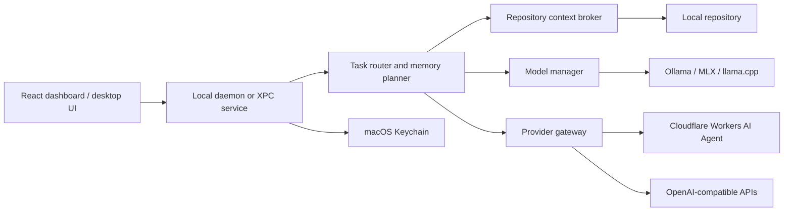

# Flex Fieldfare Architecture

## 1. Product Intent

Flex Fieldfare is a local-first coding workspace for Apple Silicon Macs. It keeps repository context and ordinary inference on the user's machine, while allowing explicitly configured API providers and Cloudflare Workers AI agents to handle approved cloud tasks.

The current repository contains the React/Vite dashboard prototype. The architecture below describes the intended product boundary and the implementation path from this UI prototype to a desktop application and hosted control plane.

## 2. Design Principles

- **Local first:** local models and repository data are the default execution path.
- **Smallest capable model:** route each task to the lowest-cost model that satisfies its context and reasoning requirements.
- **Explicit cloud consent:** cloud fallback is opt-in, visible, and auditable.
- **Minimal context transfer:** send only the files, symbols, and task context required for a request.
- **Provider abstraction:** Ollama is the development runtime; production runtimes can use MLX or llama.cpp without changing the UI contract.
- **Resource awareness:** model loading considers unified memory, KV-cache growth, concurrent requests, and the operating system's safety reserve.
- **Reversible operations:** provider settings, routing policies, and model residency can be changed without changing repository data.

## 3. System Context



The dashboard should communicate with a local service rather than calling model providers directly. This keeps credentials, filesystem access, tool permissions, and cloud redaction outside the browser surface.

## 4. Runtime Layers

### 4.1 Presentation layer

The React/Vite application provides:

- Overview of memory, inference, repository, and connection health.
- Model library and residency controls.
- Provider and Cloudflare Worker configuration flows.
- Repository indexing status and retrieval priorities.
- Usage, limits, routing, and privacy settings.

The UI uses provider-neutral actions such as `addConnection`, `loadModel`, `scanRepository`, and `setRoutingPolicy`. These actions should eventually call the local service through authenticated IPC.

### 4.2 Local service layer

A native daemon or macOS XPC service owns privileged local operations:

- Starts and supervises the inference runtime.
- Reads repository files and git state.
- Stores provider credentials in Keychain.
- Applies tool and filesystem policies.
- Exposes health, usage, and streaming events to the UI.
- Prevents browser code from directly handling secrets or unrestricted filesystem access.

A local HTTP loopback API can be used during development. Production should prefer authenticated XPC or an equivalent restricted local IPC boundary.

### 4.3 Orchestration layer

The orchestration layer coordinates four components:

1. **Task classifier:** identifies autocomplete, edit, explanation, planning, search, or agent tasks.
2. **Memory planner:** estimates prompt tokens, completion budget, KV-cache cost, and available unified memory.
3. **Task router:** selects a local model, queues or unloads models, and requests consent before cloud escalation.
4. **Policy engine:** redacts secrets, applies repository scope, limits tools, and records decisions.

A routing decision should return both the selected provider and an explanation suitable for the UI, for example: `local / qwen-coder-1.5b / fits budget / no cloud required`.

### 4.4 Model management layer

The model manager maintains a fleet of local and remote model records:

- Model identifier, provider, quantization, disk footprint, and context window.
- Current residency: unloaded, loading, warm, evicting, or unavailable.
- Task capabilities and quality tier.
- Memory estimate including weights, runtime overhead, and KV cache.
- LRU activity and pinning state.

For the Apple M4 24 GB target, the initial safe operating budget is approximately 13-18 GB for model and runtime use after macOS and application overhead. The manager should retain a safety reserve, prefer the small coding model for fast paths, and only load larger models when the memory planner permits it.

The StreamingExpertManager research design can later inform expert-level paging and Metal completion fencing. That research track should remain isolated from the first production integration so the dashboard can ship against Ollama or MLX first.

## 5. Repository Context Broker

The context broker converts a repository into compact, ranked context:

- Open files and cursor selections.
- Git diff and recently changed files.
- Symbol definitions, references, imports, and dependency edges.
- Repository instructions and relevant documentation.
- Test and build metadata.

Retrieval should be local and deterministic. It should rank context by task relevance and token cost, avoid sending unrelated files, and provide a user-visible list of included files before any cloud request.

The first implementation can use a local file scanner and language-aware symbol extraction. A later implementation can add an embedded index with incremental updates, file hashes, and repository watch events.

## 6. Provider Gateway

The provider gateway normalizes streaming generation and health checks across providers:

```ts
interface ModelProvider {
  id: string
  health(): Promise<ProviderHealth>
  listModels(): Promise<ModelInfo[]>
  stream(request: InferenceRequest): AsyncIterable<InferenceEvent>
}
```

Initial adapters:

- **Ollama:** local development and health checks at `127.0.0.1:11434`.
- **OpenRouter:** optional cloud fallback using an API key stored in Keychain.
- **OpenAI-compatible endpoint:** configurable base URL, model, and authentication.
- **Cloudflare Workers AI Agent:** configurable Worker URL and scoped token for approved agent tasks.

Cloudflare integration should use a narrow Worker contract. The Worker should authenticate the request, validate the task type, enforce allowed tools, apply request-size limits, and return structured events rather than exposing arbitrary upstream access.

## 7. Security and Privacy

### Browser and local development

The current prototype intentionally presents configuration UI only. It must not be treated as secure credential storage. Browser `localStorage` is acceptable only for non-secret mock state during prototyping.

### Desktop production

- Store API tokens in macOS Keychain.
- Keep repository access in the local service.
- Bind development APIs to loopback and require an app-issued session token.
- Redact common secrets before cloud transfer.
- Require explicit user approval for cloud fallback and agent tools.
- Record provider, model, files shared, policy decision, latency, and token counts in a local audit log.
- Provide a visible kill switch for cloud access.

## 8. Data Flow

### Local coding request

1. UI submits a task and current editor context to the local service.
2. Context broker ranks relevant local files and symbols.
3. Memory planner estimates the request against available memory and context limits.
4. Task router selects a warm local model or schedules a load.
5. Provider streams tokens back through the local service.
6. UI displays output, selected model, latency, and included context.

### Cloud escalation

1. Router determines that local models cannot satisfy the task or the user explicitly selects cloud execution.
2. Policy engine checks cloud fallback, provider health, task type, and tool permissions.
3. Context broker produces a minimal file manifest and redacts secrets.
4. UI requests consent when policy requires it.
5. Provider gateway sends the approved payload through the configured API or Cloudflare Worker.
6. Audit log records the decision and data boundary.

## 9. Observability and Limits

The dashboard should expose:

- Local and cloud request counts.
- Current resident memory and safety headroom.
- Model load and eviction latency.
- Tokens per second and time to first token.
- Context size, cache hit rate, and retrieved file count.
- Cloud data transfer and provider errors.

Limits should be enforced before execution, not after failure. When memory is near the configured ceiling, the router should choose a smaller model, reduce context, queue the request, or ask for explicit cloud approval.

## 10. Delivery Plan

### Phase 1: Prototype contract

- Keep the current React/Vite dashboard.
- Add typed mock services for models, connections, repository status, and usage.
- Add navigation and modal tests.
- Add `Ollama` health-check plumbing behind a provider interface.

### Phase 2: Local development service

- Implement a loopback service with streaming responses.
- Add repository scanning, git status, and incremental indexing.
- Add model list, load, unload, and health operations.
- Persist non-secret settings locally; keep tokens out of browser storage.

### Phase 3: Desktop hardening

- Package the UI with a native macOS host.
- Move filesystem, provider, and credential access behind XPC.
- Add Keychain storage, redaction, audit events, and signed release builds.
- Add memory-aware scheduling and reliable cancellation.

### Phase 4: Cloud and agent integrations

- Implement OpenRouter and OpenAI-compatible adapters.
- Implement a scoped Cloudflare Worker AI Agent contract.
- Add consent screens, per-provider limits, and cloud usage reporting.
- Add backend authentication and billing only when hosted collaboration is required.

### Phase 5: Research runtime

- Evaluate MLX and llama.cpp for production local inference.
- Prototype expert streaming and GPU fencing based on `StreamingExpertManager`.
- Compare quality, memory, load latency, and throughput against the stable provider interface.

## 11. Current Repository Scope

Implemented now:

- React/Vite dashboard shell.
- Overview, Models, Connections, Repository, Usage & limits, and Settings views.
- Provider configuration modal for Cloudflare Workers AI, OpenRouter, OpenAI-compatible, and local endpoints.
- Local-first visual routing controls and responsive layout.
- Favicon and production build configuration.

Not yet implemented:

- Real model inference calls.
- Persistent secure credentials.
- Native daemon/XPC service.
- Repository scanner and symbol index.
- Cloudflare Worker deployment or API calls.
- Authentication, billing, hosted control plane, and automated test suite.
